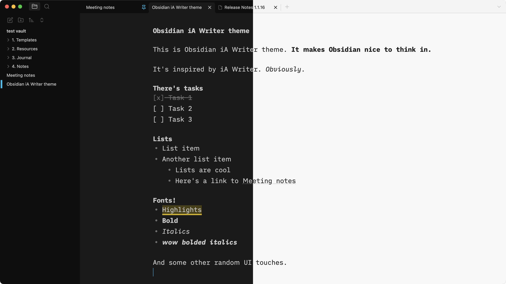

# Obsidian iA Writer theme

Makes Obsidian nice to think in.

## Installation

For now just copy the theme.css file to snippets.

## Optional settings
- Go to Settings → Appearance
	- Set your accent color to `#18BEEC`
	- Turn off 'Show tab title bar' option
	- Turn on 'Translucent window' option
- In Settings → Editor turn off 'Show indentation guides'
- Install [hider plugin]() and hide UI elements for a cleaner look

## License
MIT
